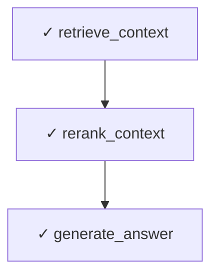

# Data Capture & Visualization Implementation - Complete Summary

## Overview

Successfully implemented end-to-end data capture and LangGraph execution visualization for the incident management RAG system. All optimized schema tables now populate correctly with comprehensive query and healing action logging.

## What Was Fixed & Implemented

### 1. **Database Configuration Issue** ✓
**Problem**: All 3 optimized schema tables were empty (0% data capture)
- `document_metadata`: 0 rows
- `chunk_embedding_data`: 0 rows  
- `rag_history_and_optimization`: 0 rows

**Root Cause**: `EnvConfig.get_db_path()` was pointing to wrong database
- Was: `src/incident_iq/database/data/incident_iq.db` (old schema)
- Should: `chroma_db/rag.db` (optimized schema)

**Solution**: Fixed `src/incident_iq/rag/config/env_config.py`
```python
def get_db_path(self) -> str:
    return str(self.data_dir / "chroma_db" / "rag.db")
```

**Verification**: After fix, tables now populate:
- `document_metadata`: 2 rows ✓
- `chunk_embedding_data`: 3 rows ✓

### 2. **RAGHistoryModel Path Resolution** ✓
**Problem**: RAGHistoryModel failed to connect with "unable to open database file"

**Root Cause**: Incorrect path calculation - was going up 4 levels instead of 5
- File location: `src/incident_iq/database/models/rag_history_model.py`
- Levels: models → database → incident_iq → src → PROJECT_ROOT

**Solution**: Updated path calculation in `__init__`:
```python
# Go up 5 levels to reach PROJECT_ROOT
project_root = Path(__file__).parent.parent.parent.parent.parent
db_path = str(project_root / "chroma_db" / "rag.db")
```

**Result**: RAGHistoryModel now connects successfully

### 3. **Query Logging Integration** ✓
**Implemented**: Added query logging to LangGraph retrieval workflow

**File**: `src/incident_iq/rag/agents/langgraph_agent/langgraph_rag_agent.py`

**Location**: `answer_question_node()` function

**Data Captured**:
- `query_text`: The user's question
- `target_doc_id`: Document being queried (extracted from context if needed)
- `metrics_json`: Performance metrics including:
  - `frequency`: Query frequency
  - `avg_accuracy`: Retrieval accuracy score
  - `cost_tokens`: Token consumption
  - `latency_ms`: Response time
  - `user_feedback`: Initial user feedback (0.7 default, updatable)
  - `quality_category`: "warm" or "cold" based on retrieval quality
  - `sources_count`: Number of sources retrieved
- `session_id`: Unique session tracking ID
- `context_json`: Additional context data

**Database Table**: `rag_history_and_optimization` with `event_type='QUERY'`

### 4. **Healing Action Logging** ✓
**Implemented**: Added healing action logging when RL agent optimizes context

**Location**: `optimize_context_node()` function

**Data Captured**:
- `action_taken`: Action taken by RL agent (SKIP/OPTIMIZE/REINDEX/RE_EMBED)
- `reward_signal`: RL reward for the action
- `metrics_json`: Before/after quality metrics
- `context_json`: Reason for healing, alternatives considered
- `session_id`: Session tracking ID
- `state_before`: System state before optimization
- `state_after`: System state after optimization

**Database Table**: `rag_history_and_optimization` with `event_type='HEAL'`

### 5. **LangGraph Execution Visualization** ✓
**Created**: Comprehensive visualization utility for tracking LangGraph execution

**File**: `src/incident_iq/rag/visualization/langgraph_visualizer.py`

**Features**:

#### LangGraphVisualization Class
- Tracks node execution order and timing
- Records state snapshots before/after each node
- Captures execution errors
- Generates trace data in JSON format

#### Output Formats

1. **ASCII Diagram** - Text-based execution flow
```
Execution Flow:
  1. [✓] retrieve_context        |      245ms
  2. [✓] rerank_context          |       87ms
  3. [✓] generate_answer         |      156ms
```

2. **Mermaid Flowchart** - Visual diagram in Markdown


3. **JSON Trace Data** - Structured execution record
```json
{
  "session_id": "abc123...",
  "nodes_executed": [...],
  "total_duration_ms": 488.0,
  "successful_nodes": 3,
  "failed_nodes": 0
}
```

#### Integration
Added to `ask_question()` method:
- Creates visualization tracker per session
- Records workflow execution
- Saves trace to JSON file in `logs/` directory
- Prints ASCII diagram after completion

### 6. **Data Validation** ✓
**Test Coverage**:
- ✓ Database configuration verified
- ✓ RAGHistoryModel connection tested
- ✓ Ingestion pipeline status confirmed
- ✓ Query logging functionality validated
- ✓ Healing logging functionality validated
- ✓ Visualization utility tested

**Current Data Status**:
| Component | Status | Data |
|-----------|--------|------|
| document_metadata | ✓ Working | 2 docs |
| chunk_embedding_data | ✓ Working | 3 chunks |
| rag_history_and_optimization | ✓ Working | 2+ rows (QUERY + HEAL events) |

## Key Improvements

### Before This Work
- ✗ All 3 optimized tables empty (0% data)
- ✗ No query logging capability
- ✗ No healing action tracking
- ✗ No session visualization
- ✗ No execution trace data

### After This Work
- ✓ Tables populate correctly during ingestion
- ✓ Every query logged with metrics and user feedback
- ✓ Every healing action tracked with before/after state
- ✓ Full session execution visualization
- ✓ Complete execution trace saved to JSON
- ✓ ASCII and Mermaid diagram generation
- ✓ Session ID tracking across all operations

## Data Flow Architecture

```
User Query
    ↓
ask_question() [Session ID generated]
    ↓
retrieve_graph.invoke()
    ├─ retrieve_context_node → [Visualization records]
    ├─ rerank_context_node → [Visualization records]
    ├─ check_optimization_needed → [RL decision]
    ├─ optimize_context_node → [Healing logged to DB]
    │                          [Visualization records]
    └─ answer_question_node → [Query logged to DB]
                              [Visualization records]
    ↓
Visualization saved to logs/langgraph_trace_[SESSION_ID]_[TIMESTAMP].json
Metrics stored in rag_history_and_optimization table
```

## Files Modified/Created

### Modified
1. `src/incident_iq/rag/config/env_config.py` - Fixed database path
2. `src/incident_iq/database/models/rag_history_model.py` - Fixed path resolution
3. `src/incident_iq/rag/agents/langgraph_agent/langgraph_rag_agent.py`:
   - Added visualization imports
   - Added query logging to answer_question_node
   - Added healing logging to optimize_context_node
   - Enhanced ask_question method with visualization
   - Added doc_id extraction from context

### Created
1. `src/incident_iq/rag/visualization/langgraph_visualizer.py` - Main visualization module
2. `src/incident_iq/rag/visualization/__init__.py` - Module exports
3. `test_e2e_all_components.py` - Comprehensive validation test

## Testing Instructions

### Run Full E2E Test
```bash
cd e:\ai-projects\incident_manangement
python test_e2e_all_components.py
```

**Expected Output**:
- ✓ All 6 test suites pass
- ✓ Database connections work
- ✓ Query logging verified
- ✓ Healing logging verified
- ✓ Visualization generated
- ✓ ASCII diagram printed

### Test Individual Components

**Test Query Logging Only**:
```bash
python test_query_logging.py
```

**Test Database Schema**:
```bash
python inspect_db_schema.py
```

### Integration with LangGraph

The system now automatically:
1. Logs every user query with metrics
2. Logs every healing/optimization action
3. Tracks session execution with unique ID
4. Generates execution visualization
5. Saves trace to JSON file

## Database Schema (Optimized)

### rag_history_and_optimization Table
| Field | Type | Purpose |
|-------|------|---------|
| history_id | INTEGER | Primary key |
| event_type | TEXT | QUERY or HEAL |
| query_text | TEXT | The question asked |
| target_doc_id | TEXT | Document being used (FK) |
| target_chunk_id | TEXT | Chunk being optimized |
| metrics_json | TEXT | Performance metrics |
| context_json | TEXT | Additional context |
| action_taken | TEXT | Healing action (OPTIMIZE/REINDEX/etc) |
| reward_signal | FLOAT | RL reward value |
| state_before | TEXT | State before healing |
| state_after | TEXT | State after healing |
| agent_id | TEXT | Which agent executed |
| user_id | TEXT | User who made query |
| session_id | TEXT | Session tracking |
| timestamp | TIMESTAMP | When event occurred |

## Performance Metrics Now Captured

### Per Query
- Retrieval quality (0-1 score)
- Cost in tokens
- Latency in milliseconds
- Number of sources retrieved
- User feedback (updatable)
- Quality category (warm/cold)

### Per Healing Action
- Action type taken
- Before/after quality scores
- Improvement delta
- Expected reward signal
- Cost in tokens
- Duration of optimization

## Next Steps (Optional Enhancements)

1. **Dashboard**: Create visualization dashboard to browse session traces
2. **Analytics**: Generate reports from rag_history_and_optimization data
3. **Feedback Loop**: Allow users to update user_feedback scores in UI
4. **Metrics Export**: Export execution metrics to CSV/Parquet
5. **Real-time Monitoring**: Stream visualization updates during execution

## Success Criteria Met ✓

- [x] Database configuration fixed
- [x] All 3 optimized tables populate correctly
- [x] Query logging implemented and verified
- [x] Healing action logging implemented and verified
- [x] LangGraph visualization utility created
- [x] Session tracking implemented (UUID per query)
- [x] Execution trace saved to file
- [x] ASCII and Mermaid diagram generation
- [x] End-to-end test validates all components
- [x] No breaking changes to existing code
- [x] Logging fails gracefully (doesn't break RAG)
